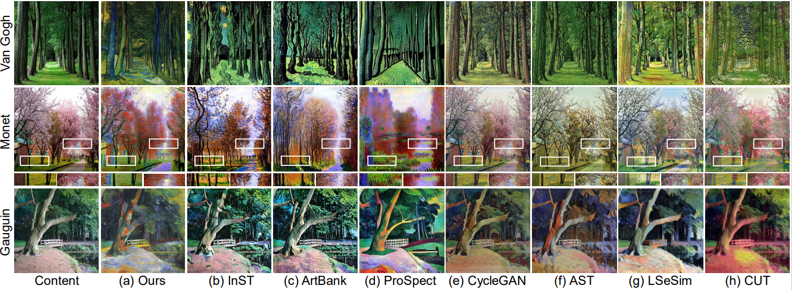

<div id="top"></div>
<!--
*** Thanks for checking out the Best-README-Template. If you have a suggestion
*** that would make this better, please fork the repo and create a pull request
*** or simply open an issue with the tag "enhancement".
*** Don't forget to give the project a star!
*** Thanks again! Now go create something AMAZING! :D
-->


<!-- PROJECT SHIELDS -->
<!--
*** I'm using markdown "reference style" links for readability.
*** Reference links are enclosed in brackets [ ] instead of parentheses ( ).
*** See the bottom of this document for the declaration of the reference variables
*** for contributors-url, forks-url, etc. This is an optional, concise syntax you may use.
*** https://www.markdownguide.org/basic-syntax/#reference-style-links
-->
<!-- [![Contributors][contributors-shield]][contributors-url]
[![Forks][forks-shield]][forks-url]
[![Stargazers][stars-shield]][stars-url]
[![Issues][issues-shield]][issues-url]
[![MIT License][license-shield]][license-url]
[![LinkedIn][linkedin-shield]][linkedin-url] -->


<!-- PROJECT LOGO -->
<br />
<!-- <div align="center">
  <a href="https://github.com/othneildrew/Best-README-Template">
    
  </a>

  <h3 align="center">Best-README-Template</h3>

  <p align="center">
    An awesome README template to jumpstart your projects!
    <br />
    <a href="https://github.com/othneildrew/Best-README-Template"><strong>Explore the docs »</strong></a>
    <br />
    <br />
    <a href="https://github.com/othneildrew/Best-README-Template">View Demo</a>
    ·
    <a href="https://github.com/othneildrew/Best-README-Template/issues">Report Bug</a>
    ·
    <a href="https://github.com/othneildrew/Best-README-Template/issues">Request Feature</a>
  </p>
</div> -->


<!-- TABLE OF CONTENTS -->
<!-- <details>
  <summary>Table of Contents</summary>
  <ol>
    <li>
      <a href="#about-the-project">CAST</a>
      <ul>
        <li><a href="#built-with">Built With</a></li>
      </ul>
    </li>
    <li>
      <a href="#getting-started">Getting Started</a>
      <ul>
        <li><a href="#prerequisites">Prerequisites</a></li>
        <li><a href="#installation">Installation</a></li>
      </ul>
    </li>
    <li><a href="#usage">Usage</a></li>
    <li><a href="#roadmap">Roadmap</a></li>
    <li><a href="#contributing">Contributing</a></li>
    <li><a href="#license">License</a></li>
    <li><a href="#contact">Contact</a></li>
    <li><a href="#acknowledgments">Acknowledgments</a></li>
  </ol>
</details> -->


<!-- ABOUT THE PROJECT -->
## Towards Highly Realistic Artistic Style Transfer via Stable Diffusion with Step-aware and Layer-aware Prompt Inversion (IJCAI2024)

<!--  -->

	
Artistic style transfer aims to transfer the learned artistic style onto an arbitrary content image, generating artistic stylized images. Existing generative adversarial network-based methods fail to generate highly realistic stylized images and always introduce obvious artifacts and disharmonious patterns. Recently, large-scale pre-trained diffusion models opened up a new way for generating highly realistic artistic stylized images. However, diffusion model-based methods generally fail to preserve the content structure of input content images well, introducing some undesired content structure and style patterns. To address the above problems, we propose a novel pre-trained diffusion-based artistic style transfer method, called LSAST, which can generate highly realistic artistic stylized images while preserving the content structure of input content images well, without bringing obvious artifacts and disharmonious style patterns. Specifically, we introduce a Step-aware and Layer-aware Prompt Space, a set of learnable prompts, which can learn the style information from the collection of artworks and dynamically adjusts the input images' content structure and style pattern.
To train our prompt space, we propose a novel inversion method, called Step-ware and Layer-aware Prompt Inversion, which allows the prompt space to learn the style information of the artworks collection.
In addition, we inject a pre-trained conditional branch of ControlNet into our LSAST, which further improved our framework's ability to maintain content structure.
Extensive experiments demonstrate that our proposed method can generate more highly realistic artistic stylized images than the state-of-the-art artistic style transfer methods.

For details see the [paper](https://arxiv.org/abs/2404.11474) 

<p align="right">(<a href="#top">back to top</a>)</p>


<!-- ### Built With -->
<!-- 
This section should list any major frameworks/libraries used to bootstrap your project. Leave any add-ons/plugins for the acknowledgements section. Here are a few examples.

* [Next.js](https://nextjs.org/)
* [React.js](https://reactjs.org/)
* [Vue.js](https://vuejs.org/)
* [Angular](https://angular.io/)
* [Svelte](https://svelte.dev/)
* [Laravel](https://laravel.com)
* [Bootstrap](https://getbootstrap.com)
* [JQuery](https://jquery.com)

<p align="right">(<a href="#top">back to top</a>)</p>
 -->


<!-- GETTING STARTED -->
## Getting Started

### Prerequisites

For packages, see environment.yaml.

  ```sh
  conda env create -f environment.yaml
  conda activate ldm
  ```

<p align="right">(<a href="#top">back to top</a>)</p>

### Installation

   Clone the repo
   ```sh
   git clone https://github.com/Jamie-Cheung/LSAST
   ```

<p align="right">(<a href="#top">back to top</a>)</p>

### Train

   Train LSAST:
   
   Firstly, you can download the pretrained v1-5-pruned.ckpt (stable diffusion 1.5) from https://huggingface.co/runwayml/stable-diffusion-v1-5/tree/main/ and save it at ./models/sd1.5/v1-5-pruned.ckpt.

   You can find Artowkrs from https://drive.google.com/drive/folders/1_2jykbjVCF6SqJisvIt5-4fAFzVAj-F0?usp=drive_link
   
   ```sh
   python main.py --base configs/stable-diffusion/v1-finetune.yaml
               -t 
               --actual_resume ./models/sd1.5/v1-5-pruned.ckpt
               -n <run_name> 
               --gpus 0, 
               --data_root /path/to/directory/with/images

   python main.py --base configs/stable-diffusion/v1-finetune.yaml -t --actual_resume ./models/sd1.5/v1-5-pruned.ckpt -n test --gpus 0, --data_root ./Artworks/paul-gauguin
   ```
  
 
   
   See `configs/stable-diffusion/v1-finetune.yaml` for more options
   
   
<p align="right">(<a href="#top">back to top</a>)</p>

### Test
  Download the pretrained [Controlnet] from https://huggingface.co/lllyasviel/ControlNet-v1-1/tree/main and save control_v11p_sd15_canny.pth as ./models/controlnet/control_v11p_sd15_canny.pth.

  Download the pretrained model [LSAST] ([https://drive.google.com/drive/folders/1_2jykbjVCF6SqJisvIt5-4fAFzVAj-F0?usp=drive_link](https://drive.google.com/drive/folders/1Il2xvl38ubMuoVQoGSEBcjnnWrxXYElE?usp=drive_link))

  You only need to change the line 184 with the pretrained model, then you can:
  
  To generate new images, run test.py

  ```sh
  python test.py
  ```

### Citation
   
   ```sh
   @article{zhang2024towards,
   title={Towards Highly Realistic Artistic Style Transfer via Stable Diffusion with Step-aware and Layer-aware Prompt},
   author={Zhang, Zhanjie and Zhang, Quanwei and Lin, Huaizhong and Xing, Wei and Mo, Juncheng and Huang, Shuaicheng and Xie, Jinheng and Li, Guangyuan and Luan, Junsheng and Zhao, Lei and others},
   journal={arXiv preprint arXiv:2404.11474},
   year={2024}
   }
   ```
   
<p align="right">(<a href="#top">back to top</a>)</p>


<!-- 
<!-- USAGE EXAMPLES -->
<!-- ## Usage

Use this space to show useful examples of how a project can be used. Additional screenshots, code examples and demos work well in this space. You may also link to more resources.

_For more examples, please refer to the [Documentation](https://example.com)_

<p align="right">(<a href="#top">back to top</a>)</p> -->


<!-- ROADMAP -->
<!-- ## Roadmap

- [x] Add Changelog
- [x] Add back to top links
- [ ] Add Additional Templates w/ Examples
- [ ] Add "components" document to easily copy & paste sections of the readme
- [ ] Multi-language Support
    - [ ] Chinese
    - [ ] Spanish

See the [open issues](https://github.com/othneildrew/Best-README-Template/issues) for a full list of proposed features (and known issues).

<p align="right">(<a href="#top">back to top</a>)</p> -->


<!-- CONTRIBUTING -->
<!-- ## Contributing -->

<!-- Contributions are what make the open source community such an amazing place to learn, inspire, and create. Any contributions you make are **greatly appreciated**.

If you have a suggestion that would make this better, please fork the repo and create a pull request. You can also simply open an issue with the tag "enhancement".
Don't forget to give the project a star! Thanks again!

1. Fork the LSAST
2. Create your Feature Branch (`git checkout -b feature/AmazingFeature`)
3. Commit your Changes (`git commit -m 'Add some AmazingFeature'`)
4. Push to the Branch (`git push origin feature/AmazingFeature`)
5. Open a Pull Request
 -->
<!-- <p align="right">(<a href="#top">back to top</a>)</p> -->


<!-- LICENSE -->
<!-- ## License -->
<!-- 
Distributed under the MIT License. See `LICENSE.txt` for more information.
 -->
<!-- <p align="right">(<a href="#top">back to top</a>)</p> -->


<!-- CONTACT -->
## Contact

Please feel free to open an issue or contact us personally if you have questions, need help, or need explanations. Write to one of the following email addresses:

cszzj@zju.edu.cn(Preferred) or my co-contributing author cszqw@zju.edu.cn


<!-- 
Your Name - [@your_twitter](https://twitter.com/your_username) - email@example.com

Project Link: [https://github.com/your_username/repo_name](https://github.com/your_username/repo_name)
 -->
<p align="right">(<a href="#top">back to top</a>)</p>


<!-- ACKNOWLEDGMENTS -->
<!-- ## Acknowledgments -->
<!-- 
Use this space to list resources you find helpful and would like to give credit to. I've included a few of my favorites to kick things off!

* [Choose an Open Source License](https://choosealicense.com)
* [GitHub Emoji Cheat Sheet](https://www.webpagefx.com/tools/emoji-cheat-sheet)
* [Malven's Flexbox Cheatsheet](https://flexbox.malven.co/)
* [Malven's Grid Cheatsheet](https://grid.malven.co/)
* [Img Shields](https://shields.io)
* [GitHub Pages](https://pages.github.com)
* [Font Awesome](https://fontawesome.com)
* [React Icons](https://react-icons.github.io/react-icons/search) -->

<!-- <p align="right">(<a href="#top">back to top</a>)</p> -->


<!-- MARKDOWN LINKS & IMAGES -->
<!-- https://www.markdownguide.org/basic-syntax/#reference-style-links -->
[contributors-shield]: https://img.shields.io/github/contributors/othneildrew/Best-README-Template.svg?style=for-the-badge
[contributors-url]: https://github.com/othneildrew/Best-README-Template/graphs/contributors
[forks-shield]: https://img.shields.io/github/forks/othneildrew/Best-README-Template.svg?style=for-the-badge
[forks-url]: https://github.com/othneildrew/Best-README-Template/network/members
[stars-shield]: https://img.shields.io/github/stars/othneildrew/Best-README-Template.svg?style=for-the-badge
[stars-url]: https://github.com/othneildrew/Best-README-Template/stargazers
[issues-shield]: https://img.shields.io/github/issues/othneildrew/Best-README-Template.svg?style=for-the-badge
[issues-url]: https://github.com/othneildrew/Best-README-Template/issues
[license-shield]: https://img.shields.io/github/license/othneildrew/Best-README-Template.svg?style=for-the-badge
[license-url]: https://github.com/othneildrew/Best-README-Template/blob/master/LICENSE.txt
[linkedin-shield]: https://img.shields.io/badge/-LinkedIn-black.svg?style=for-the-badge&logo=linkedin&colorB=555
[linkedin-url]: https://linkedin.com/in/othneildrew
[product-screenshot]: images/screenshot.png
